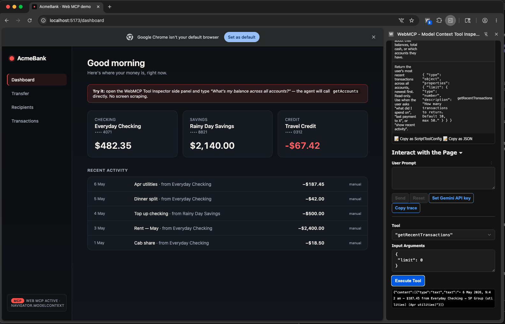

# WebMCP · AcmeBank Demo

A tiny **fake banking app** that exposes its actions as **Web MCP tools** —
so an in-browser AI agent can call `getAccounts`, `findRecipient`, or
`transferFunds` like functions, with **no DOM scraping, no screenshots, no
brittle selectors**.

The point isn't the bank. The point is that you can hand an LLM a
*structured tool surface for the page it's already looking at*, including
a **human-in-the-loop confirm modal** before any sensitive action goes
through. That's the WebMCP pitch in 600 lines of React + TypeScript.



> The screenshot above shows the app in **Chrome Canary** with the
> **WebMCP Model Context Tool Inspector** extension open in the side
> panel. The left side is the bank UI. The right side is the agent's
> view of the same page — the tool list, schemas, and an *Execute Tool*
> button that calls into the page directly.

---

## Why this exists

Today, an in-browser agent (ChatGPT Atlas, Comet, Claude-in-Chrome,
Copilot) navigates a website by **screenshotting the DOM and guessing
where to click**. It's slow, expensive (token-heavy), and breaks the
moment a CSS selector changes.

[**WebMCP**](https://github.com/webmachinelearning/webmcp) (W3C Web
Machine Learning CG draft, co-edited by Google Chrome and Microsoft Edge
teams) flips that around: the **website declares its tools** —
`bookFlight`, `addToCart`, `transferFunds` — with JSON Schemas, and the
in-browser agent calls them as functions.

This repo is the smallest interesting working example I could build:

- **3 read-only tools** registered globally (`getAccounts`,
  `getRecentTransactions`, `findRecipient`).
- **2 sensitive tools** registered *only on the page where they make
  sense* (`transferFunds` on `/transfer`, `addRecipient` on
  `/recipients`) — so the agent's available actions change as the user
  navigates. This is **per-page contextual scoping**, the thing
  classical (server-side) MCP can't do.
- **Confirm-before-act** for sensitive tools, via the spec's
  `agent.requestUserInteraction(callback)` API. The agent can ask, but
  the user has to click *Approve* before money moves.
- **Pure client-side**: in-memory state in `localStorage`. No backend,
  no real bank, no real money. Wipes with the *Reset demo data* button.

---

## Run it

You have two paths. Pick whichever matches your hurry.

### Path A — full demo with Chrome Canary + Tool Inspector (5 min setup)

This is the path that gives you the screenshot above.

1. **Install Chrome Canary 146+** (this repo was tested with 149).
   - macOS: `brew install --cask google-chrome@canary`
   - Windows / Linux: <https://www.google.com/chrome/canary/>
2. Open `chrome://flags/#enable-webmcp-testing` → set to **Enabled** →
   click **Relaunch**.
3. Install the [**WebMCP Model Context Tool Inspector**](https://chromewebstore.google.com/detail/webmcp-model-context-tool/gbpdfapgefenggkahomfgkhfehlcenpd)
   extension.
4. *(Optional)* Click *Set Gemini API key* in the Inspector's side panel
   and paste a free [Google AI Studio](https://aistudio.google.com/) key.
   This unlocks the natural-language *"Send $50 to Meena for dinner"*
   mode. Manual JSON-args mode works without a key.
5. Run the app:
   ```bash
   git clone https://github.com/sahajamit/webmcp-acmebank-demo.git
   cd webmcp-acmebank-demo
   npm install
   npm run dev          # → http://localhost:5173
   ```
6. Open <http://localhost:5173> in Canary. The sidebar pill should say
   *"Web MCP active"*.
7. Click the WebMCP Inspector toolbar icon. Side panel opens. You'll see
   3 tools listed. Try **Execute Tool** with `getAccounts` and `{}` as
   args — you should get the structured response back.

### Path B — see something move in 60 seconds, no Canary required

The app installs the
[`@mcp-b/webmcp-polyfill`](https://www.npmjs.com/package/@mcp-b/webmcp-polyfill)
on boot. This means in **any** modern browser (Chrome stable, Firefox,
Safari, Edge), `navigator.modelContext` exists and tools register.
You won't have the Inspector extension, but you can drive the tools
straight from DevTools console:

```bash
git clone https://github.com/sahajamit/webmcp-acmebank-demo.git
cd webmcp-acmebank-demo
npm install
npm run dev
```

Open <http://localhost:5173> in your normal browser → DevTools → Console:

```js
// What tools is the page exposing right now?
navigator.modelContextTesting.listTools().map(t => t.name);
// → ["getAccounts", "getRecentTransactions", "findRecipient"]

// Call one
const result = await navigator.modelContextTesting.executeTool(
  'getAccounts', '{}'
);
console.log(JSON.parse(result));

// Navigate to /transfer in the app, then run listTools() again
// — "transferFunds" appears.
```

The polyfill is non-destructive: when it later runs in Chrome Canary
with the flag, it detects the native impl and steps aside.

---

## Tools reference

All five tools live under `src/mcp/`. Below: schema, sample input,
sample response. Run any of these via `navigator.modelContextTesting.executeTool(name, JSON.stringify(args))`
or via the Inspector's **Execute Tool** form.

### `getAccounts`

Lists the user's accounts with current balances. **Read-only** — no
confirm modal.

| Field | Type | Required | Notes |
|---|---|---|---|
| *(no args)* | — | — | Pass `{}` |

**Sample input**

```json
{}
```

**Sample response**

```json
{
  "content": [{
    "type": "text",
    "text": "• Everyday Checking (checking, •••• 4071) — $482.35\n• Rainy Day Savings (savings, •••• 8821) — $2,140.00\n• Travel Credit (credit, •••• 0312) — -$67.42\n\nNet (excl. credit): $2,622.35"
  }]
}
```

### `getRecentTransactions`

Returns recent transactions across all accounts, newest first.
**Read-only**.

| Field | Type | Required | Notes |
|---|---|---|---|
| `limit` | `number` | no | How many rows. Default 10, max 50. |

**Sample input**

```json
{ "limit": 3 }
```

**Sample response**

```json
{
  "content": [{
    "type": "text",
    "text": "• 6 May 2026, 9:42 am — $187.45 from Everyday Checking → SP Group (utilities) (Apr utilities)\n• 5 May 2026, 3:42 pm — $42.00 from Everyday Checking → Meena Iyer (Dinner split)\n• 4 May 2026, 3:42 pm — $500.00 from Rainy Day Savings → Everyday Checking (Top up checking)"
  }]
}
```

### `findRecipient`

Searches saved payees by name, bank, or last-4 of account. **Read-only**.
Returns IDs you can pass to `transferFunds`.

| Field | Type | Required | Notes |
|---|---|---|---|
| `query` | `string` | yes | Free-text |

**Sample input**

```json
{ "query": "meena" }
```

**Sample response**

```json
{
  "content": [{
    "type": "text",
    "text": "• Meena Iyer — DBS Bank, •••• 5621 (id: rcp_meena)"
  }]
}
```

### `transferFunds` *(only registered on `/transfer`)*

Sends money from one of the user's accounts to a recipient or to another
of their accounts. **Pops a confirm modal** — the user must click
*Approve* before the transfer executes.

| Field | Type | Required | Notes |
|---|---|---|---|
| `fromAccountId` | `string` | yes | From `getAccounts` |
| `toRecipientId` | `string` | one-of | From `findRecipient` |
| `toAccountId` | `string` | one-of | For internal transfers |
| `amount` | `number` | yes | SGD, e.g. `50.00` |
| `memo` | `string` | no | Optional note |

**Sample input**

```json
{
  "fromAccountId": "acc_chk",
  "toRecipientId": "rcp_meena",
  "amount": 50,
  "memo": "Dinner split"
}
```

**Sample response (after user clicks Approve)**

```json
{
  "content": [{
    "type": "text",
    "text": "Transfer t_lkj9d8 for $50.00 from Everyday Checking to Meena Iyer completed."
  }]
}
```

**Sample response (if user clicks Cancel)**

```json
{
  "content": [{ "type": "text", "text": "Transfer cancelled by user. No money moved." }],
  "isError": true
}
```

### `addRecipient` *(only registered on `/recipients`)*

Saves a new payee for future transfers. **Pops a confirm modal** before
saving.

| Field | Type | Required | Notes |
|---|---|---|---|
| `name` | `string` | yes | Display name |
| `bank` | `string` | yes | e.g. `"DBS Bank"` |
| `accountNumber` | `string` | yes | Last 4 digits |

**Sample input**

```json
{ "name": "Priya Menon", "bank": "DBS Bank", "accountNumber": "1234" }
```

**Sample response**

```json
{
  "content": [{
    "type": "text",
    "text": "Saved Priya Menon (id: rcp_lkj9d8). Future transfers can use this ID."
  }]
}
```

---

## What's interesting in the source

The entire demo is small — a glance at these files will get you 80% of
the WebMCP mental model.

| File | Purpose |
|---|---|
| `src/mcp/globalTools.ts` | The 3 read-only tools registered for the whole app at boot. |
| `src/mcp/transferTool.ts` | The headline tool — uses `agent.requestUserInteraction` to gate the transfer behind a confirm modal. |
| `src/mcp/recipientTool.ts` | Same confirm pattern for *"save a new payee"*. |
| `src/mcp/useTool.ts` | Custom React hook. Registers a tool on mount, unregisters on unmount → lets pages own their own tool surface. |
| `src/mcp/confirm.tsx` | The *"agent wants to do X — approve?"* modal. |
| `src/mcp/types.ts` | Local type re-exports + Navigator augmentation (sourced from `@mcp-b/webmcp-types`). |
| `src/store/bank.ts` | In-memory bank state. Tracks whether each transaction came from the UI or from an agent (`channel: 'ui' \| 'agent'`). |
| `src/main.tsx` | Boots the polyfill, registers global tools, mounts React. |

### Three patterns worth stealing

**1. Per-page tool registration via React lifecycle**

```ts
// src/mcp/useTool.ts
export function useTool(tool: ToolDescriptor) {
  useEffect(() => {
    navigator.modelContext.registerTool(tool);
    return () => navigator.modelContext.unregisterTool(tool.name);
  }, [tool.name]);
}
```

Used inside a page component:

```tsx
// src/pages/Transfer.tsx
const transferTool = useMemo(() => makeTransferFundsTool(), []);
useTool(transferTool);
```

When the user navigates away, React unmounts the page → tool
unregisters. The agent's tool list shrinks. **That's contextual MCP
working.**

**2. Confirm-before-act with `requestUserInteraction`**

```ts
// inside execute()
const approved = await agent.requestUserInteraction(async () => {
  return agentConfirm({
    title: 'Approve transfer?',
    details: [
      { label: 'From', value: from.nickname },
      { label: 'To', value: toLabel },
      { label: 'Amount', value: fmtSGD(amountCents) },
    ],
  });
});

if (!approved) {
  return { content: [{ type: 'text', text: 'Cancelled.' }], isError: true };
}
// ... execute the actual transfer
```

The agent calls the tool, control flows into your `execute`, you pause
on `requestUserInteraction`, the user sees a real native modal, decides,
and only *then* does the tool resolve.

**3. Tagging agent-initiated state changes**

Every transaction stores `channel: 'ui' | 'agent'`. The UI shows a
coral *"via agent"* tag on rows the agent created. Two reasons it
matters:

- **Auditability** — users want to know what their agent did on their
  behalf.
- **Demo storytelling** — on the *Transactions* page, agent-initiated
  rows visually pop, making the "the agent really did this" moment
  legible.

---

## Resetting + persistence

State is stored in `localStorage` under the key `acmebank.state.v1`.
Hit the **Reset demo data** button on the *Transactions* page to wipe and
reseed.

---

## Known notes

- **`npm audit` shows 2 moderate vulnerabilities** — both are in
  transitive `vite`/`esbuild` dev dependencies, not anything that ships
  to the browser. They will resolve on the next Vite minor.
- **Spec is unstable.** `@mcp-b/webmcp-polyfill` v2.2.0 (2026-03-12)
  matches the W3C CG draft as of May 2026. The names of methods on
  `navigator.modelContext` may shift before stable rollout to Chrome
  (targeted H2 2026). I'll bump versions as the spec moves.
- **`navigator.modelContextTesting`** is a Chromium *testing* surface,
  separate from `navigator.modelContext`. Site code uses
  `modelContext`; the Inspector extension and console-driven tests use
  `modelContextTesting.listTools()` / `executeTool()`. Don't mix them
  up.

---

## See it explained

I built this for an episode of *The Agentic Engineer* (YouTube channel
on agentic AI) walking through the WebMCP paradigm end-to-end —
problem, spec, demo, and what changes if it ships to stable Chrome.

The walkthrough on this exact code lives at:
**[YouTube link to be added once published]**

---

## References

- WebMCP spec proposal: <https://github.com/webmachinelearning/webmcp>
- Chrome Early Preview Program post: <https://developer.chrome.com/blog/webmcp-epp>
- Tool Inspector extension repo: <https://github.com/beaufortfrancois/model-context-tool-inspector>
- Polyfill on npm: <https://www.npmjs.com/package/@mcp-b/webmcp-polyfill>
- Curated demo list: <https://github.com/webmcpnet/awesome-webmcp>

---

## License

MIT — see [`LICENSE`](LICENSE). Use this however you want, including as
a starting point for your own WebMCP-tooled site.

If this saved you a few hours of figuring out the API surface, a star on
the repo is appreciated.
